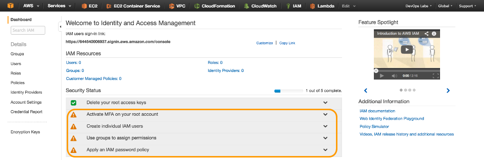
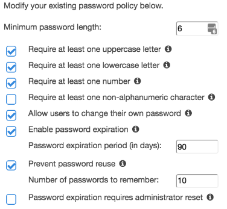
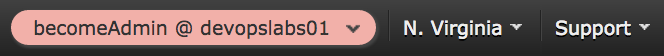

## Lab01 - **IAM - Identity and Access Management**


### Parte 1 - Completando items do _IAM Security Status_ e deixá-los todos verdinhos
* _Active MFA_: usando o [authy](https://www.authy.com) do instrutor(a), ative _MFA (Multi Factor Authentication)_.

* _Create individual IAM users_: crie um usuário para cada dev do par
Garanta que *"Generate an access key for each user"* esteja selecionado e faça o _download_ das credenciais.

* _Use groups to assign permissions_: crie um grupo chamado **dev** com _policy_ **PowerUserAccess** e adicione os usuários do par nele

* _Apply an IAM policy_: Use a sugestão abaixo



* Criar senha para seus usuários

* Mantenha a conta root logada em um browser e

* Acesse com seu usuário através de um outro browser

### Parte 2 - Testando usuários criados
Qual URL irá usar para acessar essa conta sem a root credentials?

Daqui por diante o **browser root** refere-se ao browser logado como root e **browser poweruser** refere-se ao browser logado com seu usuário.

**No browser root**
IAM > Dashboard > Customize
https://devopslabs<# da sua conta>.signin.aws.amazon.com/console

**No browser poweruser**

* Acesse o link acima

* Use seu user/pass

* Tente abrir o IAM

* Erros, erros everywhere!

**Detalhe do erro**
```
Welcome to Identity and Access Management

We encountered the following errors while processing your request:
User: arn:aws:iam::644540006937:user/rafa is not authorized to perform: iam:GetAccountSummary
```

* arn:aws:iam::644540006937:user/rafa - **principal**
* iam:GetAccountSummary - **action**

**PowerUserAccess** Policy
```
{
  "Version": "2012-10-17",
  "Statement": [
    {
      "Effect": "Allow",
      "NotAction": "iam:*",
      "Resource": "*"
    }
  ]
}
```

### Parte 3 - Dando acesso estilo "sudo"
**No browser root**
* IAM > Roles > Create New Role

* Role Name: becomeAdmin

* Role for Cross-Account Access

* Provide access between AWS accounts you own

* Account ID? (verifique o ARN nos erros do browser poweruser)

* Require MFA > não tique

* Attach Policy > AdmnistratorAccess

* Review > **COPIE O LINK MOSTRADO**

* Create Role

**No browser poweruser**

* Cole o link copiado do browser root

* Aceite as sugestões e


* Atenção ao canto superior direito:



* Tente abrir o IAM

* Erros, erros everywhere?????

* Feito!

Já conhece IAM, Policies, Roles e o "sudo" da AWS 😜

### Parte 4 - Esquecendo que o usuário root existe
**No browser root**

* Logout da conta root

* Acesse com sua conta poweruser

**No browser poweruser**

* Feche-o-ô
